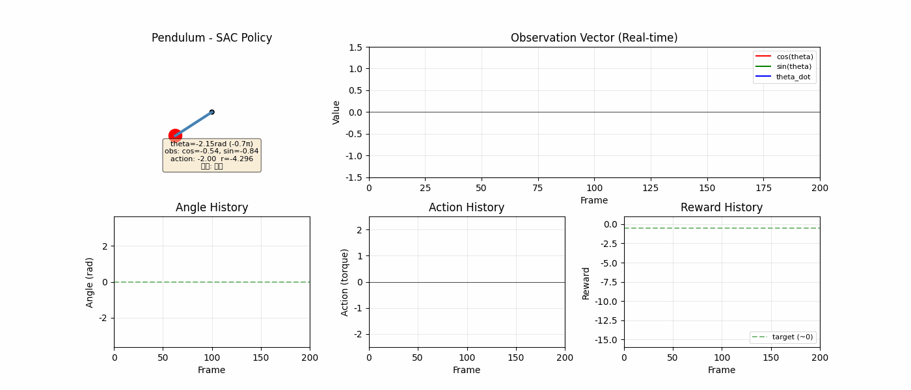
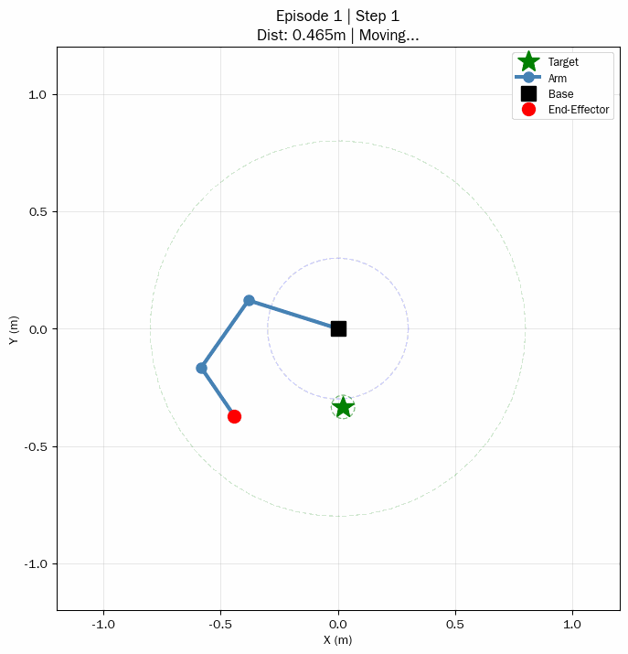
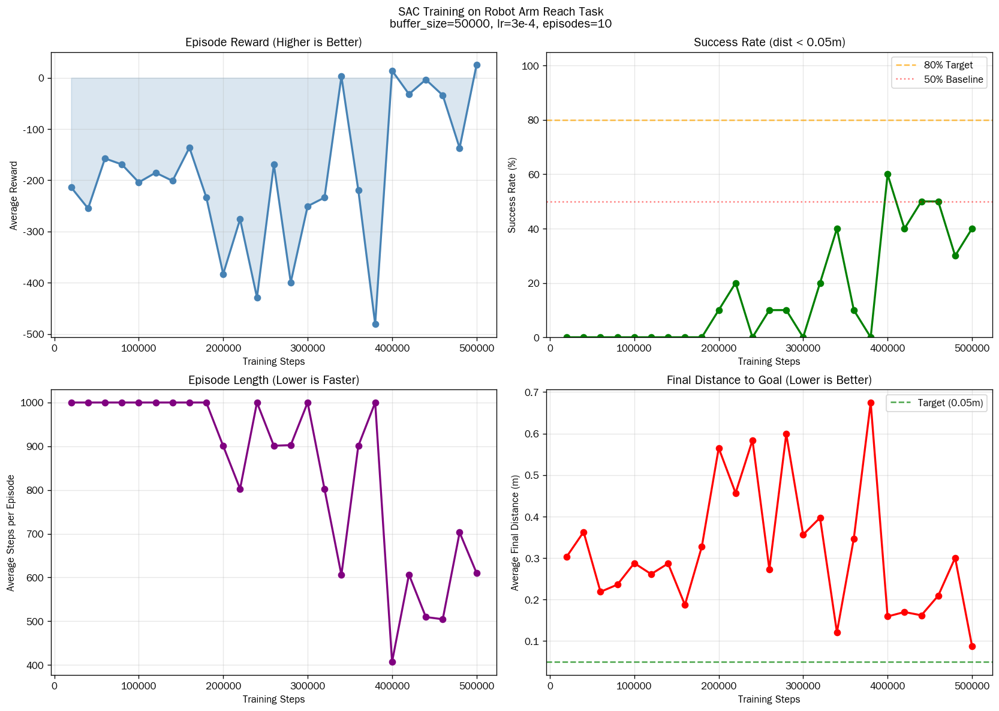

# Robot Learning: From Q-Learning to SAC


从零理解强化学习核心算法，在 Gymnasium 环境中完成 SAC 训练，并将机械臂封装成自定义 Gym 环境，最后复刻 FetchReach 标准 benchmark。

**课程目标**: 掌握 RL 核心算法 (Q-Learning → REINFORCE → SAC → FetchReach)，完成从理论到落地的完整闭环。

---

## 项目结构

```
robot-learning/
├── README.md
├── requirements.txt
├── LICENSE
├── .gitignore
├── src/
│   ├── step1_q_learning.py              # Q-Learning 表格式 RL
│   ├── step2_reinforce.py              # REINFORCE 策略梯度
│   ├── step3_sac_sb3.py                # SAC + Stable-Baselines3
│   ├── step4_robot_env.py               # 自定义 Gymnasium 环境
│   ├── step5_fetch_reach.py            # PyBullet UR5 复刻 FetchReach
│   ├── step5b_official_fetch.py         # 官方 FetchReach 完美复刻
│   ├── visualize_pendulum.py            # Pendulum 可视化
│   ├── visualize_step4.py               # 机械臂可视化
│   ├── visualize_step5b.py             # FetchReach 模型可视化
│   ├── test_official_fetch_render.py    # 官方 FetchReach 渲染测试
│   └── assets/                         # 训练结果与可视化
│       ├── step3_reward_curve.png
│       ├── pendulum_sac.gif
│       ├── step4_training_curves.png
│       ├── robot_arm_validation.gif
│       └── ...
├── docs/
│   ├── 01_q_learning.md                 # Step1 详细文档
│   ├── 02_reinforce.md                 # Step2 详细文档
│   ├── 03_sac.md                       # Step3 详细文档
│   ├── 04_robot_env.md                 # Step4 详细文档
│   ├── 05_fetch_reach.md               # Step5 详细文档
│   ├── 05b_official_fetch.md           # Step5B 详细文档
│   ├── 05_algorithm_history.md          # 算法进化史
│   ├── 06_interview.md                 # 面试知识点
│   └── 07_similar_cases.md             # 类似案例调研
└── configs/
    └── hyperparameters.yaml             # 超参数配置
```

---

## 学习路线

```
Step 1: Q-Learning       → 表格式 RL，理解 Bellman 方程
Step 2: REINFORCE       → 策略梯度，手写反向传播
Step 3: SAC + SB3       → 深度 RL，掌握 off-policy
Step 4: 自定义 Gym 环境 → 工程能力，机器人控制落地
Step 5: FetchReach       → 标准 benchmark，复现工业级环境
```

---

## 训练效果

### Step 3: SAC 倒立摆



### Step 4: 3-DOF 机械臂到达



训练曲线：



---

## 快速开始

### 环境安装

```bash
# 创建虚拟环境
conda create -n robotics python=3.9
conda activate robotics

# 安装依赖
pip install gymnasium stable-baselines3 pybullet gymnasium-robotics
pip install matplotlib numpy pandas pillow tqdm

# 验证安装
python -c "import gymnasium; print('gymnasium:', gymnasium.__version__)"
```

### 运行训练

```bash
cd src

# Step 1: Q-Learning (CartPole)
python step1_q_learning.py

# Step 2: REINFORCE (CartPole)
python step2_reinforce.py

# Step 3: SAC (Pendulum)
python step3_sac_sb3.py

# Step 4: 自定义机械臂环境 (SAC + Curriculum Learning)
python step4_robot_env.py

# Step 5: PyBullet UR5 复刻 FetchReach
python step5_fetch_reach.py

# Step 5B: 官方 FetchReach (MuJoCo)
python step5b_official_fetch.py
```

---

## 环境说明

| 环境 | 算法 | 动作空间 | 任务 |
|------|------|----------|------|
| CartPole-v1 | Q-Learning / REINFORCE | 离散 (2) | 平衡杆 |
| Pendulum-v1 | SAC | 连续 (1) | 倒立摆 |
| 自定义 3-DOF | SAC + Curriculum | 连续 (2) | 机械臂到达 |
| FetchReach | SAC | 连续 (4) | 7-DoF 机械臂到达 |

---

## 核心算法实现

### Step 1: Q-Learning (表格式)

```python
# Bellman 方程更新
Q(s, a) ← Q(s, a) + α × [r + γ × max_a' Q(s', a') - Q(s, a)]
```

### Step 2: REINFORCE (策略梯度)

```python
# 策略梯度定理
∇J(θ) = E_τ[Σ_t ∇log π_θ(a_t|s_t) × G_t]
```

### Step 3: SAC (最大熵)

```python
# 最大熵目标
J(π) = E[Σ_t (r_t + α × H(π(·|s_t))]
```

---

## Step 4 vs Step 5B 设计对比

| 对比项 | Step4 (3-DoF 纯数学) | Step5B (FetchReach) |
|--------|----------------------|---------------------|
| 物理引擎 | 无（纯FK） | MuJoCo |
| Episode 长度 | 50 步 | 50 步 |
| 动作空间 | 末端位移 [dx, dy] | 末端位移 + 夹爪 [dx, dy, dz, gripper] |
| 观测空间 | 9维 (相对位置+关节角+目标) | Goal-Aware 字典 |
| 成功阈值 | 5cm | 5cm |
| 收敛步数 | 100K | 100K |

---

## 面试要点

1. **Bellman 方程**: Q(s,a) = r + γ·max Q(s',a')
2. **策略梯度**: ∇J(θ) = E[∇log π(a|s)·G]
3. **SAC 最大熵**: J(π) = E[r + α·H(π)]
4. **On vs Off-policy**: PPO vs SAC 的本质区别
5. **稀疏奖励**: HER / Reward Shaping / Curriculum Learning
6. **Sim2Real**: Domain Randomization / 系统辨识
7. **Goal-Aware RL**: 观测空间包含 achieved_goal 和 desired_goal

---

## 参考资料

- [Sutton & Barto - 强化学习导论](http://incompleteideas.net/book/the-book-2nd.html)
- [OpenAI Spinning Up](https://spinningup.openai.com/)
- [Gymnasium 文档](https://gymnasium.farama.org/)
- [Stable-Baselines3 文档](https://stable-baselines3.readthedocs.io/)
- [Gymnasium Robotics](https://robotics.farama.org/)

---

## License

MIT License
